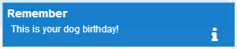
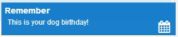
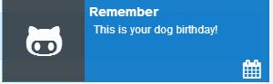
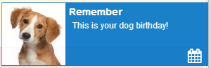
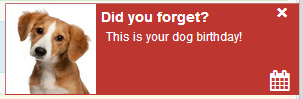

# toastr8
**toastr8** is a jQuery notification plugin for creating Windows 8 metro inspired toast messages that use Font Awesome for notification icons.

## Current Version
1.0.3

## Demo
- Demo can be found at http://saribe.github.io/toastr8

## Wiki and Change Log
[Wiki including Change Log](https://github.com/saribe/toastr8/wiki)

###3 Easy Steps
For other API calls, see the [demo](http://saribe.github.io/toastr8).

1. Link to toastr8.css `<link href="http://rawgit.com/saribe/toastr8/master/dist/css/toastr8.min.css" rel="stylesheet"/>`

2. Link to toastr8.js ``

3. use toastr8 to display a toast notifcation

		// Display an info notification with no title
		toastr8.info('This is your dog birthday!');

		// Display an info notification with title
		toastr8.info('This is your dog birthday!', "Remember");
		

		// Alternative display an info notification with title and custom icon
		toastr8.info({
			message:'This is your dog birthday!', 
			title:"Remember",
			iconClass: "fa fa-calendar"
		});

		// Alternative display an info notification with title and custom icon and image from css class
		toastr8.info({
			message:'This is your dog birthday!', 
			title:"Remember",
			iconClass: "fa fa-calendar",
			imgClass: "dog-foto-img"
		});

		
		// Alternative display an info notification with title and custom icon and image from url
		toastr8.info({
			message:'This is your dog birthday!', 
			title:"Remember",
			iconClass: "fa fa-calendar",
			imgURI: ["http://domain/images/failoverDogFoto.jpg" "http://domain/images/niceFoto.png" ]
		});

### Other Options
	// able toasts
	var toasts = ["info", "error", "warning", "success", "facebook", "twitter", "skype", "android", "linkedIn", "windows", "googlePlus", "gitHub"];
	
	for(var i = 0, k = toasts.length; i < k; i++){
	
		toastr8[toasts[ i ] ]("message", "title");
	}

		
	// Clears the current list of toasts
	toastr8.clear()

	
### Display Sequence
Show newest toast at bottom (top is default)

	toastr8.options.newestOnTop = false;

	
### Callbacks
	// Define a callback for when the toast is shown/hidden
	toastr8.options.onShown = function() { console.log('hello'); }
	toastr8.options.onHidden = function() { console.log('goodbye'); }

## Authors
**Samuel Ribeiro **

## Credits
Inspired by https://github.com/CodeSeven/toastr.

## Copyright
Copyright © 2013 [Samuel Ribeiro](http://twitter.com/_saribe)

## License 
toastr8 is under MIT license - http://www.opensource.org/licenses/mit-license.php
